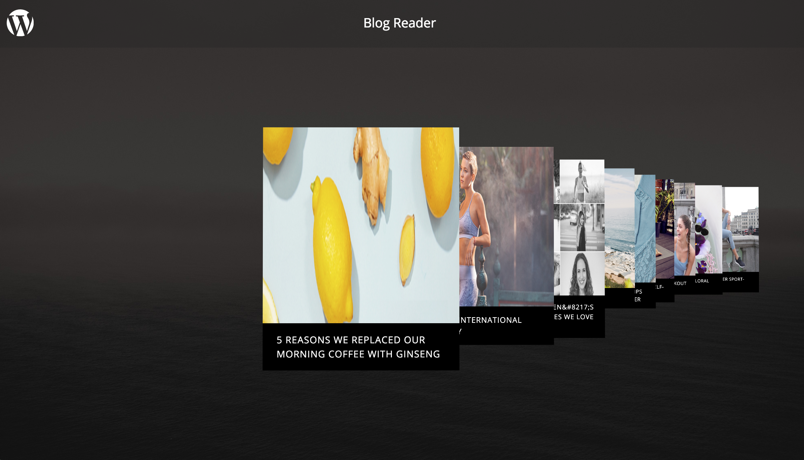

# Wordpress Blog Flow Readme

This is a MontageJS demo that loads featured posts from a remote Wordpress blog and displays them in a touch-friendly user interface.



[Live Demo](http://montagejs.github.io/montage-wordpress/)

### Quick Start

To run locally, follow these steps:

1. Clone the popcorn [GitHub repo](https://github.com/montagejs/montage-wordpress) in your desktop.
```
git clone git@github.com:montagejs/montage-wordpress.git
```

2. Install Node modules dependencies
```
npm install
```

3. Use NodeJS http-server or Spin up your preferred HTTP server and point your browser to the associated port to serve the popcorn directory.

```
npm run start
```

>**Note:** During development MontageJS applications rely on XHR to load their various components and modules,
which is why you will need a web server to serve the demo.

> You can start NodeJS http-server using command: `npm run serve`
Then open your favorite browser at (http://localhost:8080).

> If you happen to have [minit](https://github.com/montagejs/minit), the Montage Initializer, installed 
(`npm install minit -g`) you can run `minit serve` from within the demo directory to set up a server on demand.


### Run and build dist locally 

1. Build a new version in `dist/`
```
npm run build
```

2. Serve `dist/` using NodeJS http-server
```
npm run serve:dist
```

## Project Details

### Application Structure

The contents of the application are structured into the following directories and files:

* assets/ — Contains global styles and images for the application.
* node_modules/ — Contains the dependencies that power the application in development.
* ui/ — Contains the user interface components of the demo application.
* index.html — Is the entry-point HTML document for the application.
* LICENSE.md — Contains copyright information.
* package.json — Describes your app and its dependencies.
* README.md — Provides information about the demo application and how to install it.

## Use another wordpress url.

To use your wordpress instance you will need to install WP REST API Plugin, see detailed instructions:
- https://github.com/montagestudio/montage-wordpress/blob/master/README.md#prepare

Then change default `hostname` in [./ui/main.reel/main.js#L24](./ui/main.reel/main.js#L24) from `demo.wp-api.org` to your wordpress domain.

To test custom domain you can also pass hostname query parameter, example:
- http://montagejs.github.io/montage-wordpress?hostname=blog.fabletics.com

## Use you own Wordpress instance

### Prepare

We need [WP REST API](http://wp-api.org/) and [WP OAuth Server](https://wp-oauth.com/) on your WordPress site. Directly open WordPress plugin page and search and install these 2 plugins.

### Cross domian

If your client is running on differnt domian. You need modify above 2 plugins a little bit to make them support cross domain ajax calls.

##### WP REST API

In WordPress plugin page clicks edit for WP REST API plugin. Modify plugin.php file. Search `json_send_cors_headers` function and modify as following: 

```php
if ( $origin ) {
    header( 'Access-Control-Allow-Origin: *' );
    header( 'Access-Control-Allow-Methods: POST, GET, OPTIONS, PUT, DELETE' );
    header( 'Access-Control-Allow-Credentials: true' );
    header( 'Access-Control-Allow-Headers: Content-Type, X-Requested-With, Authorization' );
}
```

##### WP OAuth Server

Also in WordPress plugin page, let's edit WordPress OAuth Server plugin. In wp-oauth.php file. Change first couple lines as following

```php
if (!function_exists('add_filter')) {
    header('Status: 403 Forbidden');
    header('HTTP/1.1 403 Forbidden');
    exit();
}else{
    header( 'Access-Control-Allow-Origin: http://wordpress.montage.com' );
    header( 'Access-Control-Allow-Methods: POST, GET, OPTIONS, PUT, DELETE' );
    header( 'Access-Control-Allow-Credentials: true' );
    header( 'Access-Control-Allow-Headers: Content-Type, X-Requested-With, Authorization' );
    if($_SERVER['REQUEST_METHOD'] == 'OPTIONS'){
        exit();
    }
}
```

Note because we need send Basic Authorization data when doing token verifying. So `Access-Control-Allow-Origin` must be set to a certain domain.

## Credit

This demo application was created by the [MontageJS team](http://montagejs.org).


