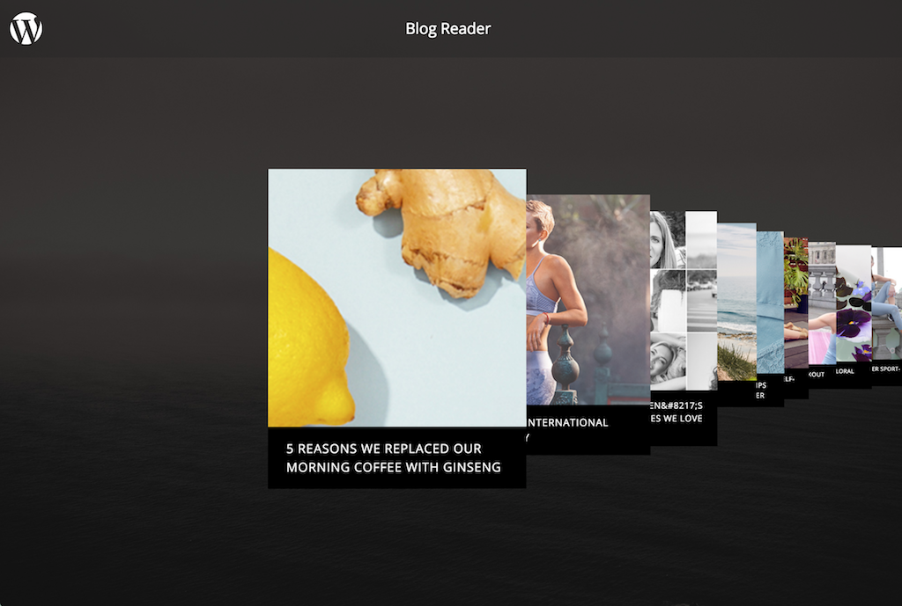

# Wordpress Blog Flow Readme

This is a MontageJS demo that loads featured posts from a remote Wordpress blog and displays them in a touch-friendly user interface.



[Live Demo](http://montagestudio.github.io/wordpress-blog-flow/)

To use your wordpress instance you will need to install WP REST API Plugin, see detailed instructions:
- https://github.com/montagestudio/montage-wordpress/blob/master/README.md#prepare

### Quick Start

To run locally, follow these steps:

1. Clone the popcorn [GitHub repo](https://github.com/montagestudio/wordpress-blog-flow) in your desktop.
```
git clone git@github.com:montagestudio/wordpress-blog-flow.git
```

2. Install Node modules dependencies
```
npm install
```

3. Use NodeJS http-server or Spin up your preferred HTTP server and point your browser to the associated port to serve the popcorn directory.

```
npm run start
```

    >**Note:** During development MontageJS applications rely on XHR to load their various components and modules,
    which is why you will need a web server to serve the demo.

    > You can start NodeJS http-server using command: `npm run serve`
    Then open your favorite browser at (http://localhost:8080).

    > If you happen to have [minit](https://github.com/montagejs/minit), the Montage Initializer, installed 
    (`npm install minit -g`) you can run `minit serve` from within the demo directory to set up a server on demand.


### Run and build dist locally 

1. Build a new version in `dist/`
```
npm run build
```

2. Serve `dist/` using NodeJS http-server
```
npm run serve:dist
```

## Project Details

### Application Structure

The contents of the application are structured into the following directories and files:

* assets/ — Contains global styles and images for the application.
* node_modules/ — Contains the dependencies that power the application in development.
* ui/ — Contains the user interface components of the demo application.
* index.html — Is the entry-point HTML document for the application.
* LICENSE.md — Contains copyright information.
* package.json — Describes your app and its dependencies.
* README.md — Provides information about the demo application and how to install it.

## Credit

This demo application was created by the [MontageJS team](http://montagejs.org).


